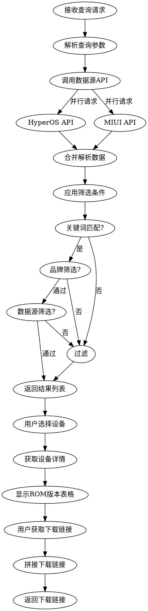

# 小米📱ROM版本查询 
## 概述 
一站式查询小米、Redmi、POCO设备的HyperOS与MIUI ROM版本信息。融合多数据源，支持设备搜索、版本筛选、固件下载链接获取等功能。 
## 应用场景 
- 用户询问"查询小米ROM版本" / "查看HyperOS固件" / "MIUI刷机包下载"  
- 用户需要查询特定设备的系统版本信息  
- 用户需要获取Recovery/线刷固件下载链接  
- 用户需要了解设备支持的Android版本  
- 用户需要对比不同分支（开发版/稳定版）的ROM版本  
## 核心能力 
- **多源数据融合**：同时查询HyperOS和MIUI数据源，自动合并马甲机信息  
- **智能搜索**：支持设备名称、代号模糊搜索，支持品牌/数据源筛选  
- **版本详情**：显示支持的HyperOS/MIUI版本、Android版本、发布日期  
- **固件下载**：提供Recovery（卡刷）和Fastboot（线刷）下载链接  
- **分支管理**：支持中国版、国际版、欧洲版等多地区分支查询  
- **智能链接拼接**：自动根据ROM类型拼接正确的下载链接，支持多镜像源  
## 示例对话
示例1：搜索设备  
用户：查询小米14的ROM版本  
→ 搜索关键词"小米14"  
→ 匹配设备：小米14 (代号: houji)  
→ 显示设备详情和ROM版本列表  
示例2：获取下载链接  
用户：小米13 Ultra的HyperOS开发版下载  
→ 定位设备：小米13 Ultra (ishtar)  
→ 筛选分支：开发版/内测版  
→ 显示Recovery和Fastboot下载链接  
## 工作流程 

### 第一步：解析查询参数 
从用户输入中提取： 
- **设备标识**：设备名称（如"小米14"）或代号（如"houji"） 
- **品牌筛选**：小米(mi)/Redmi(redmi)/POCO(poco)/全部 
- **数据源筛选**：HyperOS/MIUI/全部 
- **分支偏好**：中国版(cn)/国际版(global)/欧洲版(eea)等
- **版本类型**：稳定版/开发版/Beta版
### 第二步：获取设备列表
调用数据源API获取设备信息：
- **HyperOS数据源**：`GET https://data.hyperos.fans/devices.json`
- **MIUI数据源**：`GET https://data.miuier.com/data/devlist.json`
- 解析并合并设备数据，处理马甲机（同一设备多名称）情况。
### 第三步：应用筛选条件
按以下条件过滤设备列表：
- **关键词匹配**：设备名称、代号、别名包含搜索词
- **品牌匹配**：设备品牌符合筛选条件
- **数据源匹配**：设备包含指定的数据源类型
### 第四步：展示设备卡片
为每个匹配设备生成信息卡片，包含：
- 设备图片（自动回退到默认图标）
- 设备名称（含别名）
- 设备代号
- 数据源标签（HyperOS/MIUI）
### 第五步：获取设备详情
用户选择设备后，获取详细ROM信息：
- **HyperOS详情**：`GET https://data.hyperos.fans/devices/{code}.json`
- **MIUI详情**：`GET https://data.miuier.com/data/devices/{code}.json`
### 第六步：展示ROM版本
按分支分类展示ROM版本表格，包含：
- 版本号（HyperOS/MIUI版本）
- Android版本
- 发布日期
- 下载链接（Recovery/Fastboot）
### 第七步：拼接下载链接（关键步骤）
#### 7.1 判断链接类型
对于每个ROM版本，检查以下字段：
- `recovery`：卡刷包文件名
- `fastboot`：线刷包文件名
#### 7.2 链接拼接规则
如果存在 `recovery` 或 `fastboot` 文件名，使用以下格式拼接：
```
卡刷包链接：https://bkt-sgp-miui-ota-update-alisgp.oss-ap-southeast-1.aliyuncs.com/{version}/{recovery}
线刷包链接：https://bkt-sgp-miui-ota-update-alisgp.oss-ap-southeast-1.aliyuncs.com/{version}/{fastboot}
```
其中：
- `{version}`：ROM版本号（如 `OS3.0.7.0.WNCCNXM` 或 `V14.0.11.0.TKBCNXM`）
- `{recovery}`：卡刷包文件名
- `{fastboot}`：线刷包文件名
#### 7.3 特殊字段处理
- `ctelecom`：中国电信定制版线刷包文件名
- `carrier`：运营商信息数组，可能包含 `chinatelecom`, `chinamobile`, `chinaunicom`
#### 7.5 链接有效性检查
拼接后的链接应进行以下检查：
1. 文件名后缀应为 `.zip`（卡刷）或 `.tgz`（线刷）
2. 版本号格式应为 `OSx.x.x.x.xxxxxx`（HyperOS）或 `Vx.x.x.x.xxxxxx`（MIUI）
3. 如果 `recovery` 或 `fastboot` 字段为空字符串 `""`，则不显示对应下载按钮
## 输出格式
### 设备列表卡片
#### 小米ROM版本查询 - 找到 {N} 个设备
| 设备名称 | 代号 | 数据源 | 操作 |
|---------|------|--------|------|
| {设备名} | {code} | 🔵HyperOS 🟠MIUI | [查看详情] |
| ... | ... | ... | ... |
**筛选条件**：品牌={品牌} | 数据源={数据源} | 关键词="{关键词}"
### 设备详情页
#### {设备名称} ({代号})
| 项目 | 详情 |
|------|------|
| **HyperOS版本** | {版本列表} |
| **MIUI版本** | {版本列表} |
| **Android版本** | {Android版本列表} |
| **其他名称** | {别名} |
#### {分支名称} ({分支ID})
**🔵 HyperOS**
| 版本号 | Android | 发布日期 | 下载 |
|--------|---------|----------|------|
| {版本} | {Android} | {日期} | [📦卡刷]({卡刷链接}) [⚡线刷]({线刷链接}) |
**🟠 MIUI**
| 版本号 | Android | 发布日期 | 下载 |
|--------|---------|----------|------|
| {版本} | {Android} | {日期} | [📦卡刷]({卡刷链接}) [⚡线刷]({线刷链接}) |
## 注意事项
1. **内测版限制**：部分开发版/Beta版ROM需要小米账号权限才能刷入
2. **刷机风险**：刷机前请备份数据，确保电量充足，使用官方工具（MiFlash）进行线刷